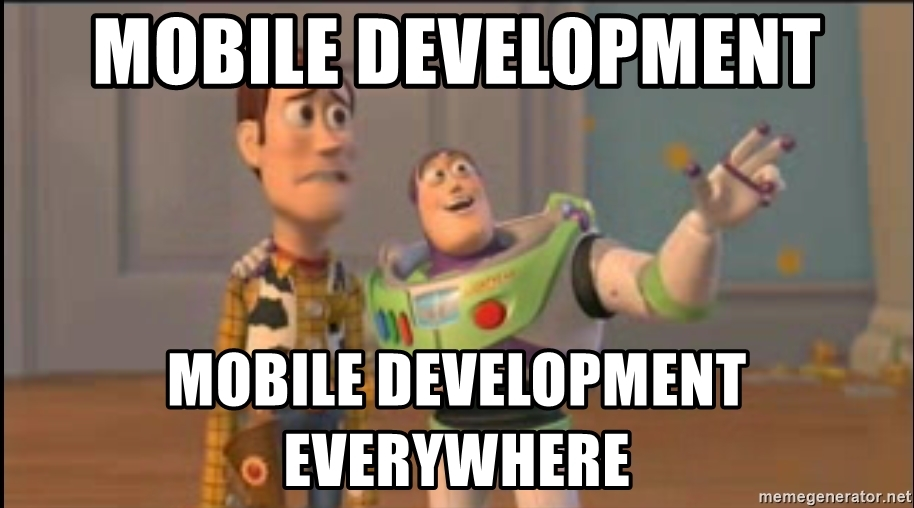

### Hi there, I'm João!

I build lots of sample apps on this account to study on my spare times.

I'm currently working at Mobile2you as Android Developer. 🔭

Mini Bio:

- 🌱My study path is Flutter, Some Android things (nobody knows everything, right? haha) and maybe iOs in the future.
- 💬 Ask me about cars, music and games.
- 📫 How to reach me: My LinkedIn is on profile.. it's the same name of this GitHub username.
- ⚡ Fun fact: Probably you will see a lot of commits here.. I like to keep the things updated.

For more information about me, please feel free to navigate throught my projects :D
